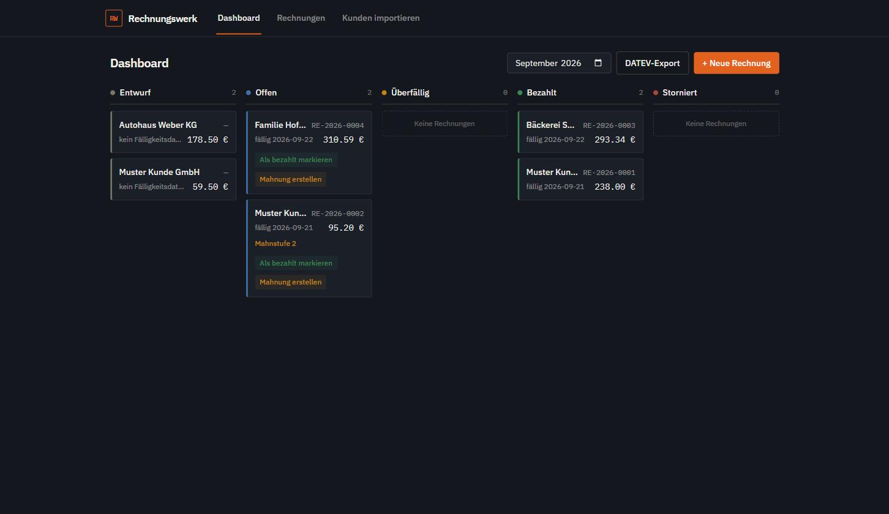
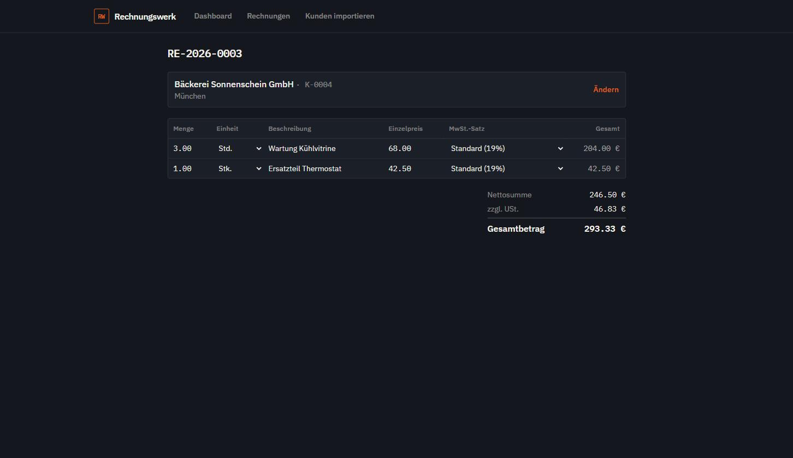
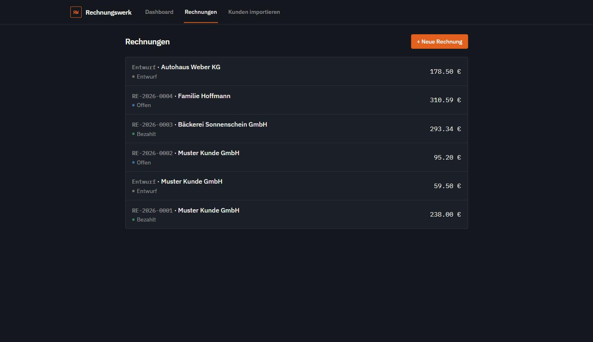

# Rechnungswerk

E-Invoicing für deutsche Handwerksbetriebe: legally-compliant ZUGFeRD/XRechnung-Rechnungen
mit eingebautem GoBD-Revisionsschutz.

Ein deutscher Handwerksbetrieb muss ab 2025 E-Rechnungen empfangen und mittelfristig auch
versenden können (EN 16931 / ZUGFeRD / XRechnung), und dabei die GoBD-Vorgaben der
Finanzverwaltung einhalten — lückenlose Rechnungsnummern, Unveränderbarkeit nach Ausstellung,
lückenloser Prüfpfad. Rechnungswerk bildet genau diesen Kern ab: eine menschenlesbare PDF-Rechnung
mit maschinenlesbarer XML eingebettet in einer PDF/A-3-Datei, plus die rechtlichen Mechanismen,
die eine Finanzprüfung verlangt.

Dieses Repository ist ein Portfolio-Projekt — es zeigt ein vollständig durchgezogenes
Domänenproblem: von der Rechtslage (EN 16931, GoBD, § 14 UStG) über ein revisionssicheres
Datenmodell bis zur XML/PDF-Generierung.

## Screenshots

| Dashboard | Rechnung (finalisiert) |
|---|---|
|  |  |



## Was die App kann

- **Rechnungen erfassen** mit einer Excel-artigen Positions-Tabelle (Tab/Enter-Navigation,
  automatische Zeilen), vier gesetzlich unterschiedene Steuerszenarien (Standard 19 %,
  ermäßigt 7 %, Kleinunternehmer § 19 UStG, Reverse Charge § 13b UStG) inklusive der jeweils
  vorgeschriebenen Pflichthinweise.
- **Finalisieren statt Speichern**: Ein Klick vergibt lückenlos die nächste Rechnungsnummer,
  berechnet die Summen serverseitig neu, baut die ZUGFeRD-XML, rendert die PDF, bettet die XML
  als PDF/A-3-Anhang ein, hasht das Ergebnis und sperrt den Datensatz — alles in einer
  Datenbanktransaktion.
- **Stornieren statt Löschen**: Eine falsche Rechnung wird nie bearbeitet oder gelöscht, sondern
  über eine neue Stornorechnung mit negierten Positionen und eigener Nummernserie ausgeglichen.
- **Kundenverwaltung** inkl. CSV/Excel-Import-Assistent mit automatischer Spaltenzuordnung.
- **Dashboard** als Kanban-Board über den Rechnungsstatus (Entwurf/Offen/Überfällig/Bezahlt/
  Storniert), mit Mahnwesen und DATEV-Export für den Steuerberater.

## GoBD-Konformität auf drei Ebenen

Das ist der eigentliche Kern des Projekts: Unveränderbarkeit wird nicht an einer Stelle geprüft,
sondern durchgängig erzwungen.

1. **Modell-Ebene**: `Invoice.save()`/`delete()` werfen einen `GoBDLockError`, sobald der
   Datensatz gesperrt ist — der einzige Weg, das zu umgehen, ist ein expliziter
   `allow_locked_write=True`, den ausschließlich der Finalisierungs-Service selbst benutzt.
2. **API-Ebene**: Eine DRF-Permission blockt PUT/PATCH/DELETE auf gesperrte Rechnungen mit 403,
   bevor die Anfrage das Modell erreicht.
3. **Audit-Log**: Ein `AuditLogEntry` ist Append-Only per Konstruktion — es gibt keinen
   Update/Delete-Endpunkt, und das Modell verweigert nachträgliche Schreibzugriffe. Jeder
   Eintrag trägt einen SHA-256-Hash über eine kanonische JSON-Momentaufnahme der Rechnung.

Die Nummernvergabe (`invoices/numbering.py`) läuft über `select_for_update()` innerhalb
derselben Transaktion, die auch den Statuswechsel persistiert — ein Rollback kann so nie eine
Lücke in der Nummernfolge hinterlassen.

## Stack

**Backend** — Django 6 + Django REST Framework, PostgreSQL. `drafthorse` baut die UN/CEFACT
CII-XML, `factur-x`/`pypdf` betten sie als PDF/A-3 ein, `WeasyPrint` rendert die
Original-PDF aus Django-Templates.

**Frontend** — React 19 + TypeScript, Vite, Tailwind CSS v4, TanStack Query. Reine
Client/Server-Trennung über eine typisierte REST-API.

```
backend/
  company/    Stammdaten des Betriebs (Singleton via django-solo)
  customers/  Kundenkartei + CSV/Excel-Import
  invoices/   Kerndomäne: Invoice, InvoiceItem, Nummernkreis, Audit-Log,
              services/ (Finalisieren, Storno, XML, PDF, PDF/A-3, Validierung)
frontend/
  src/pages/       Dashboard, Rechnungsliste, Rechnungseditor, CSV-Import
  src/components/  Positions-Grid, Kundensuche, Legal-Notices
  src/api/         typisierter fetch-Client + TanStack-Query-Hooks
```

## Lokal starten

Voraussetzung: eine laufende PostgreSQL-Instanz.

**Backend** (Python 3.13)

```bash
cd backend
python -m venv .venv
.venv\Scripts\activate           # Windows; macOS/Linux: source .venv/bin/activate
pip install -r requirements.txt
python manage.py migrate
python manage.py runserver       # http://127.0.0.1:8000
```

`DB_NAME` / `DB_USER` / `DB_PASSWORD` / `DB_HOST` / `DB_PORT` als Env-Vars, sonst greifen die
Dev-Defaults aus `config/settings/dev.py`. PDF-Rendering braucht native GTK/Pango-Bibliotheken
(WeasyPrint) — unter Windows lädt `dev.py` `C:\Program Files\GTK3-Runtime Win64\bin`
automatisch, falls vorhanden.

**Frontend** (Node.js)

```bash
cd frontend
npm install
npm run dev                      # http://localhost:5173, erwartet Backend auf :8000
```

## Tests

```bash
cd backend
python manage.py test
```

## Rechtlicher Rahmen (Referenz)

EN 16931-1:2017, ZUGFeRD 2.2 / Factur-X (Profil COMFORT bzw. EXTENDED/XRECHNUNG mit
Leitweg-ID), XRechnung 3.0, GoBD (BMF-Schreiben), PDF/A-3 (ISO 19005-3). Details zur
Business-Term-Zuordnung und zum vollständigen Funktionsumfang: [`SPEC.md`](SPEC.md).

## Stand des Projekts

Dies ist ein Einzelprojekt zu Demonstrationszwecken, kein produktiv betriebenes SaaS. Es deckt
den in `SPEC.md` beschriebenen Funktionsumfang ab (generische Handwerker-Rechnungsstellung,
Module 1–5); Auth/Mandantenfähigkeit ist im Datenschema vorbereitet, aber nicht implementiert.
Ein Repositionierungs-Konzept in Richtung Bauabrechnung (Abschlagsrechnungen, VOB) wurde
durchdacht, aber bewusst nicht umgesetzt, da zentrale Annahmen (Fachprüfung, Kundenvalidierung)
offen blieben — echte Produktentscheidungen brauchen mehr als eine Idee.

## Lizenz

MIT — siehe [`LICENSE`](LICENSE).
